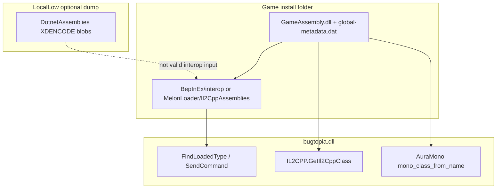

# Game Assemblies, API Access, and Tools

How **Bugtopia** reaches game code at runtime, where assemblies live on disk, which tools to use for research, and what **cannot** be substituted (for example `LocalLow` assembly dumps vs BepInEx interop).

Related: [BUILD_AND_RUN.md](./BUILD_AND_RUN.md), [TYPE_RESOLUTION.md](./TYPE_RESOLUTION.md), [BACKPACK_AND_ITEMS.md](./BACKPACK_AND_ITEMS.md), [TECHNICAL.md](./TECHNICAL.md).

---

## Overview: three runtimes in one game

Heartopia uses a **hybrid** client. The mod touches up to three separate type systems:

| Layer | What it is | Used by the mod for |
|-------|------------|---------------------|
| **IL2CPP (native)** | `GameAssembly.dll` + `il2cpp_data/Metadata/global-metadata.dat` in the game folder | Most gameplay, networking stubs, BepInEx/MelonLoader hooks, `IL2CPP.GetIl2CppClass`, Harmony |
| **BepInEx / MelonLoader interop** | Generated managed **wrappers** (`Il2Cpp*`, `Il2CppSystem`) under the loader folder | Compile-time references, `FindLoadedType`, `Il2CppSystem.Collections.Generic.List<>`, `SendCommand<T>` |
| **Embedded Mono (Aura)** | Game’s Mono module (`mono-2.0-bdwgc.dll` etc.) with images like `EcsClient`, `XDTLevelAndEntity` | Aura Farm, some protocol invokes, `mono_class_from_name` when IL2CPP stubs are incomplete |

The mod does **not** ship game assemblies. It resolves types at runtime via reflection, Il2CppInterop, and (in some features) Mono exports.



---

## Key game modules (names to search in ILSpy / logs)

| Assembly / image | Typical namespaces | Mod usage examples |
|------------------|-------------------|-------------------|
| **EcsClient** | `XDT.Scene.Shared.Modules.*`, `EcsClient.TableData` | `ItemNetPair`, task submit commands, store/ECS, anti-cheat config (research) |
| **Client** | Overlap with `XDT.Scene.*`, shared modules | Fallback when EcsClient interop is missing |
| **XDTDataAndProtocol** | `XDTDataAndProtocol.ProtocolService.*` | `TaskProtocolManager`, `WebRequestUtility.SendCommand` |
| **XDTLevelAndEntity** | `XDTLevelAndEntity.*`, `ScriptsRefactory.*` | Entities, interact, birds, fishing components |
| **XDTGameSystem** | `XDTGameSystem.GameplaySystem.*` | `BackPackSystem`, gameplay systems |
| **XDTGameUI** | `XDTGame.*` | UI panels |
| **Assembly-CSharp** | Unity / mixed | Fallback interop assembly |
| **EcsSystem** | Network managers | Client networking (research) |

Namespaces starting with `XDT.Scene.` are documented in [TYPE_RESOLUTION.md](./TYPE_RESOLUTION.md) as usually living in **EcsClient** or **Client**.

---

## Disk locations (Windows)

Replace `<Game>` with your Heartopia install (Steam, TapTap, etc.). Replace `<User>` with your Windows profile.

| Path | Contents | Role for the mod |
|------|----------|------------------|
| `<Game>/GameAssembly.dll` | IL2CPP binary | Source for interop generation; native class layout |
| `<Game>/xdt_Data/il2cpp_data/Metadata/global-metadata.dat` | IL2CPP metadata | Required for Il2CppInterop / Il2CppDumper (Steam build uses `xdt_Data`, not `Heartopia_Data`) |
| `<Game>/BepInEx/interop/*.dll` | BepInEx-generated interop | Build references (`buddy.csproj`), `Assembly.LoadFrom` preload |
| `<Game>/MelonLoader/Il2CppAssemblies/*.dll` | MelonLoader interop | Same for MelonLoader builds |
| `<Game>/BepInEx/plugins/bugtopia.dll` | Mod deploy target | — |
| `<User>/AppData/LocalLow/Bugtopia/` | Mod config (`Config.xml`) | Not game assemblies |
| `<User>/AppData/LocalLow/xd/Heartopia/DotnetAssemblies/` | **Game dump** (optional, often XDENCODE) | Research only; see [DotnetAssemblies dumps](#dotnetassemblies-dumps-locallow) |
| `<User>/AppData/LocalLow/Bugtopia/DecryptedAssemblies/` | **Mono PE dump** (mod built-in dumper) | **Primary** offline Mono source — decrypted PE + IL deobfuscation; see [Decrypting DotnetAssemblies](#decrypting-dotnetassemblies-at-runtime-built-in-dumper) |
| `<User>/AppData/LocalLow/Bugtopia/MonoDump/` | Legacy / manual Mono PE dump | Same role as `DecryptedAssemblies` if present; prefer the built-in dumper |
| Repo `ilspy-dumps/` (if present) | Decompiled C# from **embedded Mono** modules | Full method bodies; gameplay / protocol research |
| Repo `gameassembly-dumps/` (if present) | Decompiled C# from **IL2CPP** (`GameAssembly.dll`) | Type signatures + native RVAs; launcher / bootstrap / `GameApp` research |
| Repo `tools/cpp2il_out/` (if present) | Il2CppDumper raw output (`DummyDll`, `dump.cs`, `script.json`) | Regenerate `gameassembly-dumps/`; Ghidra/IDA scripts |

**BepInEx logs (example):** `<Game>/BepInEx/LogOutput.log`  
**MelonLoader logs:** `<Game>/MelonLoader/Latest.log`

---

## How the mod accesses game functions

### 1. Managed reflection (`FindLoadedType`)

- **Location:** `HeartopiaComplete.FindLoadedType` (see [TYPE_RESOLUTION.md](./TYPE_RESOLUTION.md)).
- **Requires:** Interop (or other) assemblies loaded in the mod `AppDomain`.
- **Used for:** `TaskProtocolManager`, command structs, `BackPackSystem`, UI types, most menu features.

Daily quest preload (optional disk load):

- `DailyQuestSubmitFeature.EnsureDailyQuestInteropAssembliesLoaded()` loads `EcsClient.dll`, `Client.dll`, `XDTDataAndProtocol.dll` from the loader interop folder when files exist.

### 2. IL2CPP runtime (`IL2CPP.*`)

- **Package:** `Il2CppInterop.Runtime` (referenced from loader `core` / `net6`).
- **Examples:** `IL2CPP.GetIl2CppClass("EcsClient.dll", "XDT.Scene.Shared.Modules.Backpack", "ItemNetPair")`; `HeartopiaComplete.TryFindIl2CppClass` (`il2cpp_domain_get_assemblies`, `il2cpp_class_from_name`).
- **Used when:** Interop DLL missing (for example no `EcsClient.dll` in `BepInEx/interop`) but the class exists in the live game domain — **daily quest submit v10** (`direct-submit-v10`).

### 3. Network commands (`WebRequestUtility.SendCommand<T>`)

- Command **structs** decompile from **`EcsClient.dll`** (`XDT.Scene.Shared.Modules.*`, `XDT.Scene.Shared.GamePlay.*`). Namespace on the type does **not** include an `EcsClient.` prefix; use that string only as an optional `ResolveHomelandFarmManagedType` alias when the assembly is loaded.
- **`WebRequestUtility`** decompiles from **`XDTDataAndProtocol.dll`**.
- Both are **embedded Mono** — often missing from interop `AppDomain`. See [TYPE_RESOLUTION.md](./TYPE_RESOLUTION.md) § Integration strategies → `SendCommand` (managed vs AuraMono decision table).
- **Managed** (when interop load succeeds): `ResolveHomelandFarmManagedType` + `EnsureHomelandFarmSendCommandResolver` + `TryHomelandFarmSendCommand` — see `HomelandFarmFeature.cs`.
- **AuraMono** (when managed fails): inflate `WebRequestUtility.SendCommand<T>` or invoke a `*ProtocolManager` static wrapper — see `DrawUploadFeature.cs`, `HeartopiaComplete.Fishing.cs` (Instant Catch / Reliable buoy).

### 4. AuraMono (embedded Mono API)

- **Location:** `AuraFarm.cs` — `mono_class_from_name`, `mono_runtime_invoke`, `FindAuraMonoImage("EcsClient", "EcsClient.dll")`.
- **Requires:** `EnsureAuraMonoApiReady()` + `AttachAuraMonoThread()`.
- **Used for:** Resource pick, net cook, pet feed `List<uint>`, daily quest Aura fallback, store/table data when managed types fail.
- **Not used for:** Binding `List<ItemNetPair>` via `mono_class_bind_generic_parameters` (crashes on this game).

### 5. Hooking game code (NOT Harmony on IL2CPP)

- **Do not add IL2CPP Harmony patches** (`[HarmonyPatch]` / `harmony.Patch(...)` on
  GameAssembly / UnityPlayer / interop methods) — they rewrite module `.text`, which the native
  Themis anti-cheat can integrity-hash. The mod ships **zero** such patches.
- Use a safe channel instead: EventCenter dispatch-detour (`RegisterGameEventHook`), Mono
  `NativeDetour` + `mono_compile_method` on embedded-Mono methods, AuraMono invoke/read, or
  `SendCommand<T>`. See [TYPE_RESOLUTION.md §Integration strategies](./TYPE_RESOLUTION.md#integration-strategies-after-type-is-found).

---

## DotnetAssemblies dumps (LocalLow)

Some builds write assembly blobs under:

```text
%USERPROFILE%\AppData\LocalLow\xd\Heartopia\DotnetAssemblies\
```

Example files: `EcsClient.dll`, `XDTDataAndProtocol.dll`, `XDTLevelAndEntity.dll`, plus many `System.*.dll`.

### Format (important)

| File kind | Format | Usable as BepInEx interop? |
|-----------|--------|----------------------------|
| Game modules (`EcsClient.dll`, `XDT*.dll`, …) | Custom header **`XDENCODE0001`** — not a PE/.NET assembly | **No** |
| `System.Private.CoreLib.dll`, `System.*.dll` | Normal .NET PE (CLI metadata) | **No** for interop — wrong ABI; useful only as reference for BCL version |

Checks you can run locally:

- Valid .NET assembly: starts with `MZ`, contains `BSJB`, loads with `AssemblyName.GetAssemblyName(path)`.
- Game dumps in this folder: typically **no** `MZ` at offset 0, **no** `BSJB`; CLR reports *incorrect format*.

### What you can do with DotnetAssemblies

| Goal | Approach |
|------|----------|
| Know module names | Use file names (`EcsClient`, `XDTDataAndProtocol`, …) — matches mod search lists |
| Decompile game logic | Decode XDENCODE **offline** with [`tools/XdUnpack`](#decrypting-dotnetassemblies-offline-toolsxdunpack) → `ilspycmd`; or use the runtime dumper, IL2CPP dump, or repo `ilspy-dumps/` |
| Fix mod `ItemNetPair missing` | Regenerate **loader interop** from `<Game>` or rely on **IL2CPP runtime** in mod v10+ |
| Copy into `BepInEx/interop` | **Do not** — will not replace `Il2CppInterop` stubs |

---

## Decrypting DotnetAssemblies offline (`tools/XdUnpack`)

**Preferred path — no game launch, no runtime dump.** [`tools/XdUnpack`](../tools/XdUnpack) decodes
the on-disk `%LocalLow%\xd\Heartopia\DotnetAssemblies\*.dll` straight to plaintext .NET PEs, offline.
Output is **100 % byte-exact on method IL** vs the runtime dumper and decompiles to **byte-identical
C#** (verified with `ilspycmd`). Because it reads the on-disk blobs it always matches the
**installed** build (no stale-dump drift), and it auto-detects which modules need extra work, so a
future patch needs no changes.

```powershell
# decode all modules, then decompile per-assembly into ilspy-dumps/
dotnet run -c Release --project tools\XdUnpack -- --out C:\tmp\decoded
foreach ($dll in Get-ChildItem "C:\tmp\decoded\*.dll") {
    ilspycmd -p -o "ilspy-dumps\$([IO.Path]::GetFileNameWithoutExtension($dll.Name))" $dll.FullName
}
```

Options (`--in`, `--out`, `--only`, `--copy-plain`, `--quiet`) are in
[tools/XdUnpack/README.md](../tools/XdUnpack/README.md); the decode itself is documented in the
tool's source comments. The **runtime dumper below** remains a cross-check (dumps exactly the image
currently loaded in Mono) and the only option if you lack the on-disk `DotnetAssemblies` folder.

---

## Decrypting DotnetAssemblies at runtime (built-in dumper)

The mod can produce **decrypted, file-layout PEs** of every XDENCODE game module
(`EcsClient`, `EcsSystem`, `XDT*`, `Plugins`, `EngineWrapper`, `ScriptBridge`, `MonoShared`,
`MonoUniTask`, `MsgPackFormatters`, `XDKWPerf`) without reversing the XDENCODE format — it grabs
the bytes the game itself hands its runtime *after* decryption.

### Why a managed CoreCLR hook is not enough

There are **two separate .NET runtimes in the process**, with different `System.Private.CoreLib`:

| Runtime | corelib | What lives here |
|---------|---------|-----------------|
| BepInEx / `bugtopia.dll` | `dotnet\System.Private.CoreLib.dll` (~10.6 MB) | BepInEx, Il2CppInterop, interop stubs, BCL |
| **Game (embedded Mono)** | `DotnetAssemblies\System.Private.CoreLib.dll` (~4.5 MB) | **EcsClient, EcsSystem, XDT\*, …** |

The game's modules run in an **embedded Mono runtime**, `xdt_Data\Plugins\x86_64\mono-2.0-sgen.dll`
— *not* in the CoreCLR that hosts the mod. A managed hook on `AssemblyLoadContext.LoadFromStream`
would only see BepInEx-side assemblies and **never** the game modules, so the dumper goes through the
Mono C API instead.

### How the dumper works

[MonoAssemblyDump.cs](../buddy/MonoAssemblyDump.cs) talks to the Mono C API exported by
`mono-2.0-sgen.dll`:

1. `mono_get_root_domain` + `mono_thread_attach` — attach the calling thread.
2. `mono_assembly_foreach` → `mono_assembly_get_image` — enumerate every loaded image.
3. **Filter to game modules only** — keep `EcsClient`, `EcsSystem`, `Plugins`, `EngineWrapper`,
   `ScriptBridge`, `MonoShared`, `MonoUniTask`, `MsgPackFormatters`, `XDKWPerf` and any `XDT*`; skip
   the BCL and every other Mono image.
4. Recover the decrypted PE from the `MonoImage` struct. `mono_image_get_raw_data` is **not
   exported** by this build, so the `raw_data`/`raw_data_len` pair is found by scanning the struct
   for a pointer to an `MZ` buffer that validates as a managed PE (`MZ` + `BSJB`). The offset is
   discovered once and reused. **Every native read is guarded by `VirtualQuery`**, so a bad pointer
   can never crash the process.
5. `mono_image_get_name` names each file; bytes are written verbatim.

If a future patch exports `mono_image_get_raw_data`, prefer it over the struct scan.

### Trigger and the opt-in folder

Output: `%USERPROFILE%\AppData\LocalLow\Bugtopia\DecryptedAssemblies\`.

An **empty folder is the opt-in switch** — there is no hotkey:

- **Folder exists and is empty** → the mod **auto-dumps** when the game's Mono runtime becomes ready (hooked in `EnsureAuraMonoApiReady`, [HeartopiaComplete.AuraMonoEngine.cs](../buddy/HeartopiaComplete.AuraMonoEngine.cs)).
- **~60 s later** → a **second pass** writes any **lazily loaded** modules not present at first dump (for example `Plugins.dll`). Only missing files are added; existing PEs are not overwritten.
- **Folder has files** (a previous dump) → **no dump** — clear the folder to re-dump from scratch (initial pass + 60 s retry).
- **Folder absent** → **nothing is dumped and the folder is never created.**

To enable: create the empty `DecryptedAssemblies` folder, enter the world, wait at least one minute. Look for `[MonoDump] auto-dump after runtime ready: N game module(s)`, `[MonoDump] delayed retry (60s): …`, and `[MonoDump] saved …` in `BepInEx\LogOutput.log`. Validate a result with `[Reflection.AssemblyName]::GetAssemblyName(path)` — it should report e.g. `EcsClient, Version=1.0.0.0`.

Expected game modules (15 on current builds): `EcsClient`, `EcsSystem`, `EngineWrapper`, `MonoShared`, `MonoUniTask`, `MsgPackFormatters`, `Plugins`, `ScriptBridge`, `XDKWPerf`, `XDTBaseService`, `XDTDataAndProtocol`, `XDTGameSystem`, `XDTGameUI`, `XDTLevelAndEntity`, `XDTViewBase`.

---

## Decompiling Mono PE to `ilspy-dumps/`

Turn decrypted PEs into the repo's offline C# tree with [ilspycmd](https://www.nuget.org/packages/ilspycmd).

### Prerequisites

- [**.NET SDK 6+**](https://dotnet.microsoft.com/download)
- Global ILSpy CLI: `dotnet tool install -g ilspycmd`
- Input PEs from **`DecryptedAssemblies/`** (recommended) or legacy `MonoDump/` — same format

### Output layout (important)

**One `ilspycmd` invocation per assembly**, each with its **own** `-o` subfolder under `ilspy-dumps/`:

```text
ilspy-dumps/
├── EcsClient/          ← ilspycmd -o ilspy-dumps/EcsClient EcsClient.dll
│   ├── EcsClient.csproj
│   ├── XDT.Scene.Shared.Modules.Backpack/ItemNetPair.cs
│   └── …
├── XDTLevelAndEntity/
│   ├── XDTLevelAndEntity.csproj
│   ├── XDTLevelAndEntity.BaseSystem.EntitiesManager/Entities.cs
│   └── …
└── … (one top-level folder per game module)
```

Namespace segments appear as **dot-separated folder names** (ILSpy project mode), not nested `XDT/Scene/Shared/…` path segments.

**Do not** pass every DLL to the same `-o ilspy-dumps` — that merges all assemblies into one flat namespace tree and breaks the layout docs and grep workflows expect.

### Commands (Windows PowerShell)

```powershell
$Src  = "$env:USERPROFILE\AppData\LocalLow\Bugtopia\DecryptedAssemblies"
$Repo = "C:\path\to\Heartopia-Helper"   # workspace root
$Out  = "$Repo\ilspy-dumps"

New-Item -ItemType Directory -Force -Path $Out | Out-Null

foreach ($dll in Get-ChildItem "$Src\*.dll" | Sort-Object Name) {
    $asm = [IO.Path]::GetFileNameWithoutExtension($dll.Name)
    Write-Host "Decompiling $asm ..."
    ilspycmd -p -o "$Out\$asm" $dll.FullName
}
```

Compare with a previous tree after a game patch — **use the scripted pipeline**, which also
archives the old tree as a baseline and cross-checks the removals against `buddy/`:

```bash
python tools/gameupdate/hcode.py diff --old <work>/old --detail
```

See [GAME_UPDATE_PIPELINE.md](GAME_UPDATE_PIPELINE.md) for the full flow and its gotchas.

### IL2CPP tree (separate command)

Mono `ilspy-dumps/` and IL2CPP `gameassembly-dumps/` are **different inputs**. For `GameAssembly.dll` use Il2CppDumper → `ilspycmd` on `DummyDll/` — see [GameAssembly decompilation](#gameassembly-decompilation-il2cpp) below.

### Practical workflow after a game patch

**Offline (preferred — no game launch needed):**

```bash
python tools/gameupdate/hcode.py run --write-events
```

This decodes from `%LocalLow%/xd/Heartopia/DotnetAssemblies` with `tools/XdUnpack`, verifies
ILSpy is byte-stable against an unchanged module, decompiles, diffs, promotes, and then runs the
three regression checks (binding audit, UI paths, events). Full description and every gotcha:
[GAME_UPDATE_PIPELINE.md](GAME_UPDATE_PIPELINE.md).

Afterwards:
1. Re-decode the design tables — `python tools/gameupdate/htablediff.py run` — because row schemas
   are parsed from the freshly promoted `ilspy-dumps/EcsClient/Table*.cs`.
2. Regenerate **BepInEx/MelonLoader interop** from the game install ([below](#generating-bepinex--melonloader-interop-correct-method)).

**Runtime dumper route (legacy fallback):** clear `%LocalLow%/Bugtopia/DecryptedAssemblies/`,
launch the game, enter the world, wait **≥ 60 s**, then run the per-assembly `ilspycmd` loop above.

---

## MonoDump (Bugtopia, legacy)

Older workflows (or manual copies) may use:

```text
%USERPROFILE%\AppData\LocalLow\Bugtopia\MonoDump\
```

**Prefer `DecryptedAssemblies/`** — same PE format, but produced by the shipping mod with IL body deobfuscation and the 60 s lazy-load retry. If you only have `MonoDump/`, decompile it with the **same per-assembly `ilspycmd` commands** as in [Decompiling Mono PE to `ilspy-dumps/`](#decompiling-mono-pe-to-ilspy-dumps).

### Format (differs from `xd/Heartopia/DotnetAssemblies`)

| Check | MonoDump `EcsClient.dll` | `xd/.../DotnetAssemblies/EcsClient.dll` |
|-------|--------------------------|----------------------------------------|
| PE `MZ` header | **Yes** | No (often `XDENCODE0001`) |
| CLI metadata `BSJB` | **Yes** | No |
| `AssemblyName.GetAssemblyName` | **Works** (`EcsClient, Version=1.0.0.0`) | Fails (*incorrect format*) |

These are **real managed assemblies** from the game’s **embedded Mono** side (the same logical modules AuraMono loads as `EcsClient.dll` images).

### Useful for tools?

| Tool / goal | Use MonoDump? | Notes |
|-------------|---------------|--------|
| **ILSpy / dnSpy** | **Yes — recommended** | Open `EcsClient.dll`, `XDTDataAndProtocol.dll`; find `ItemNetPair`, `TaskProtocolManager`, namespaces for `FindLoadedType` aliases |
| **Compare with repo `ilspy-dumps/`** | Yes | Names and signatures after a patch |
| **Cpp2IL / Il2CppInterop generator** | **No** | Input must be IL2CPP `GameAssembly` + `global-metadata.dat`, not Mono PE |
| **Copy into `BepInEx/interop`** | **No** | Interop stubs are Il2Cpp wrappers, not these Mono DLLs |
| **`dotnet build` reference** | Optional, dev-only | You could point `HintPath` at MonoDump for **reading** APIs; types are **not** the same as runtime Il2Cpp interop — do not assume `Invoke` on live game objects will match |
| **Runtime `Assembly.LoadFrom` in mod** | Discouraged | Duplicate type universe vs Il2Cpp interop; use IL2CPP/AuraMono paths instead |
| **Ship on another PC with the game** | **No** | Other players only need `<Game>/BepInEx/interop/` + `bugtopia.dll`; MonoDump is for **your** reverse engineering |

### Practical workflow

1. Dump PEs to `DecryptedAssemblies/` (or use legacy `MonoDump/`).
2. Decompile **each** DLL into `ilspy-dumps/<AssemblyName>/` with `ilspycmd -p` (see [Decompiling Mono PE to `ilspy-dumps/`](#decompiling-mono-pe-to-ilspy-dumps)) → copy full type names into `FindLoadedType` / docs.
3. Regenerate **BepInEx interop** from the game install for actual mod runtime.
4. Keep dump version aligned with the **same game patch** as your interop and `bugtopia.dll`.

---

## GameAssembly decompilation (IL2CPP)

The **native IL2CPP layer** lives in `<Game>/GameAssembly.dll` together with
`<Game>/xdt_Data/il2cpp_data/Metadata/global-metadata.dat`. This is a **different**
type universe from embedded Mono (`EcsClient`, `XDTLevelAndEntity`, …) and from
BepInEx/MelonLoader interop stubs.

### What each offline dump gives you

| Output | Source | Method bodies? | Best for |
|--------|--------|----------------|----------|
| **`ilspy-dumps/`** | Mono PE (`DecryptedAssemblies` / mod dumper) | **Yes** — normal C# | Gameplay, ECS commands, UI, protocols |
| **`gameassembly-dumps/`** | IL2CPP metadata + `GameAssembly.dll` | **No** — stubs with `[Address(RVA=…)]` | Bootstrap, launcher, `GameApp`, native-only APIs |
| **`tools/cpp2il_out/dump.cs`** | Same IL2CPP input | Signatures only (single file) | Quick grep across all IL2CPP types |
| **`tools/cpp2il_out/script.json`** | Il2CppDumper | N/A (offsets) | Ghidra / IDA with `ghidra.py` / `ida.py` |
| **`<Game>/BepInEx/interop/*.dll`** | Il2CppInterop generator | Partial Il2Cpp wrappers | Runtime mod development |

ILSpy on IL2CPP dummy DLLs recovers **names, fields, and RVAs**, not C# implementations.
To read native code, follow the RVA from `[Address]` or import `script.json` into a
disassembler.

### Repo layout (after a full dump)

```text
tools/
  Il2CppDumper/          # vendored Il2CppDumper CLI (not committed by default)
  Cpp2IL/bin/            # optional Cpp2IL 2022.0.7 (Windows)
  cpp2il_out/
    DummyDll/            # ~151 stub assemblies (Il2CppDumper)
    dump.cs              # all types in one file
    script.json          # method / type offsets for disassemblers
    il2cpp.h
gameassembly-dumps/      # ilspycmd output (~10k .cs files, .sln)
  GameApp/               # GameApp, GameAppHelper, launcher glue
  XDCore/                # native-side DebugCache, framework helpers
  Client/                # GameLauncher UI, hotfix entry
  Assembly-CSharp/       # mixed Unity / game IL2CPP
  …
```

Both `ilspy-dumps*` and `gameassembly-dumps*` are in `.gitignore` (large, patch-specific).

### Key IL2CPP assemblies (research)

| DummyDll / folder | Typical contents |
|-------------------|------------------|
| **GameApp** | `XD.Unity.Game.GameApp`, `GameAppHelper.GetSession()`, `IsNormalMode()` |
| **XDCore** | `XD.BaseFramework.DebugCache` (session paths — **not** the same class as `XDTGame.Core.DebugCache` in Mono) |
| **Client** | `Plugins.GameLauncher_Plugins.ScriptsGameLauncher.*`, launcher UI |
| **Assembly-CSharp** | Unity gameplay compiled to IL2CPP |
| **Engine**, **UnityEngine.*** | Engine wrappers |

Mono modules such as **EcsClient** and **XDTLevelAndEntity** are **not** duplicated as
separate folders in `gameassembly-dumps/`; they run in embedded Mono and appear in
`ilspy-dumps/` instead.

### Launch parameters and CLI (IL2CPP vs Mono)

Research across both dump trees:

| Mechanism | Where | Notes |
|-----------|-------|-------|
| **`session` parameter** | `GameAppHelper.GetSession()` (native icall in Mono bridge; IL2CPP stub in **GameApp**) | Drives `DebugCache/<session>/` paths; value comes from **native**, not from parsed `argv` in Mono |
| **`DebugCache` JSON** | Mono: `XDTGame.Core.DebugCache` under `ilspy-dumps/` | Dev flags (`UIWhiteboxEnabled`, `AutoMatchGame`, …); load/save helpers may be stripped in dump |
| **`DebugCache` session paths** | IL2CPP: `XD.BaseFramework.DebugCache` in **XDCore** | `Session`, `GetSessionRoot`, `GetSessionUIDir` |
| **`GameApp.IsNormalMode()`** | **GameApp** (IL2CPP) | Normal game vs tool/editor mode; native only |
| **`GlobalConfig.IfGameDebug`** | Mono `EngineWrapper` / native icall | Debug build flag |
| **Command-line / `argv`** | Not found in Mono decompilation | No `Main(string[] args)`, `GetCommandLineArgs`, or `Application.commandLineArgs` usage |
| **`PleaseUseLauncher`** | String in `GameLauncherTip` | Defined in Mono; no references in Mono dump — check native / **Client** launcher code |
| **`UNITASK_MAX_POOLSIZE`** | Mono UniTask only | Environment variable; not game-specific |

For launch control, prefer **`gameassembly-dumps/GameApp/`** + **`script.json`** over
guessing exe flags.

### Regenerating the dump (Windows)

Prerequisites: game installed, [.NET SDK 6+](https://dotnet.microsoft.com/download),
global [ilspycmd](https://www.nuget.org/packages/ilspycmd) (`dotnet tool install -g ilspycmd`).

Set paths (Steam default):

```powershell
$Game = "C:\Program Files (x86)\Steam\steamapps\common\Heartopia"
$Ga   = "$Game\GameAssembly.dll"
$Meta = "$Game\xdt_Data\il2cpp_data\Metadata\global-metadata.dat"
$Out  = "tools\cpp2il_out"
$Repo = "<path-to-Heartopia-Helper>"
```

**Step 1 — Il2CppDumper** (stub DLLs + offsets):

```powershell
cd "$Repo\tools\Il2CppDumper"
# Auto mode: pipe "1" when prompted; ignore "Press any key" crash at the end if dump succeeded
"1" | .\Il2CppDumper.exe $Ga $Meta "$Repo\$Out"
```

Verify: `$Out\DummyDll\` contains ~150 `.dll` files and `$Out\script.json` exists.

**Step 2 — ILSpy CLI** (C# tree):

```powershell
$dlls = Get-ChildItem "$Repo\$Out\DummyDll\*.dll" | ForEach-Object FullName
ilspycmd -p -o "$Repo\gameassembly-dumps" $dlls
```

**Optional — Cpp2IL** (`tools/Cpp2IL/bin/Cpp2IL.exe`):

```text
Cpp2IL.exe --game-path "<Game>" --exe-name xdt --output-root tools/cpp2il_out ^
  --skip-metadata-txts --disable-registration-prompts
```

Cpp2IL 2022.0.7 may hit **Windows `MAX_PATH`** when writing long `types/*_metadata.txt`
names; use `--skip-metadata-txts` or a short output path (for example `C:\ga_out`).
Il2CppDumper + ilspycmd is the supported path in this repo.

### After a game patch

1. Re-run Il2CppDumper + ilspycmd (same commands).
2. Diff `GameApp`, `Client`, and any assembly names referenced in mod logs.
3. Regenerate BepInEx/MelonLoader interop separately ([below](#generating-bepinex--melonloader-interop-correct-method)).
4. Re-dump Mono modules to `DecryptedAssemblies/` and regenerate `ilspy-dumps/` (per-assembly `ilspycmd`) if Aura or protocol types changed.

---

## Generating BepInEx / MelonLoader interop (correct method)

Interop is produced from the **game install**, not from `DotnetAssemblies`.

### Prerequisites

1. Heartopia installed with **one** loader (MelonLoader **or** BepInEx IL2CPP).
2. Launch the game at least once so the loader creates folders and runs (or triggers) interop generation.
3. .NET SDK 6+ to build the mod ([BUILD_AND_RUN.md](./BUILD_AND_RUN.md)).

### BepInEx

1. Install [BepInEx Unity IL2CPP](https://docs.bepinex.dev/) for the game.
2. Run the game once; check `<Game>/BepInEx/interop/`.
3. If game modules are missing (only `Client`, `Assembly-CSharp`, …):
   - Ensure `global-metadata.dat` exists under `xdt_Data/il2cpp_data/Metadata/`.
   - In `BepInEx/config/BepInEx.cfg`, enable/run Il2Cpp interop generation per BepInEx docs for your version (`RunIl2CppInteropGenerator` / chainloader settings).
   - Run the game again or use the Il2CppInterop CLI pointed at `<Game>` (same inputs: `GameAssembly.dll` + metadata).
4. Confirm **`EcsClient.dll`** (or equivalent) appears in `interop/` when the game ships that assembly in metadata.
5. Set `HeartopiaDir` in `buddy/Directory.Build.props` to `<Game>` and rebuild.

### MelonLoader

1. Install [MelonLoader](https://melonloader.co/download.html).
2. Run once; check `<Game>/MelonLoader/Il2CppAssemblies/` for `Il2CppEcsClient.dll` / `EcsClient.dll`.
3. Rebuild: `build-all.bat` (one unified DLL for both loaders).

### Optional compile-time reference

`buddy.csproj` references `EcsClient` only if the file exists:

```xml
<Reference Include="EcsClient" Condition="Exists('$(HeartopiaDir)\BepInEx\interop\EcsClient.dll')">
```

Missing file does **not** block the build.

---

## Game data tables & content index (`tools/HeartopiaTables`)

Offline decode + full-text **search of the game's static data** — no game launch, no runtime dump.
Two encrypted/encoded layers are recovered and merged into one searchable FTS5 index:

- **Layer A — SQLite** (`xdt_Data/StreamingAssets/Others/db/` and the `%LocalLow%\xd\Heartopia\Others\db\`
  runtime copy: `designTable.db` = localization in 11 languages, `dialogueTable.db`, `ResIndex.db` =
  asset-path→bundle index). String columns use the **SecureStorage** column cipher.
- **Layer B — design tables** (~984 tables / ~414k rows: item / stat / rarity / price /
  recipe / store / entity / task / drop / …) — a custom binary packed in a table AssetBundle, read at
  runtime by `EcsClient.TableData.Init`. Every install ships **two variants**: `<hash>_oversea.ab`
  (`oversea.bytes`, read by the global client — the default everywhere here) and `<hash>_cn.ab`
  (`cn.bytes`, read only by the China build; different event dates / unlock gates / shop
  rows). Decode the CN one only on purpose: `htables.py decode --variant cn`. Design rows store
  display names in native **zh-Hans**; the builder cross-resolves them to every language via
  Layer A, so rows are searchable in English too.

### Usage

```powershell
cd tools\HeartopiaTables
pip install -r requirements.txt      # UnityPy — only needed for `decode`
python htables.py decode             # oversea.ab -> oversea.bytes -> oversea_tables.db   (needs ilspy-dumps present)
python htables.py index              # decrypt A + load B -> heartopia_index.db (FTS5, ~3.2M docs)
python htables.py search "Pickaxe" --source B   # cross-language: Pickaxe / 곡괭이 / Топор-мотыга …
python htables.py search "金币"                 # native zh-Hans
python htables.py search 410082                 # an item id across every table (Recipe/Bagitem/Pedia/…)
python htables.py all                # decode + index
```

`decode` needs **UnityPy + `ilspy-dumps/EcsClient`** (row schemas are parsed live from the decompiled
`Table*` ctors for the current build); `index`/`search` are stdlib-only (need the SQLite DBs + a
`oversea_tables.db`). Generated DBs are gitignored (the ~424 MB index regenerates in ~16 s). Keys, the
container/row format, and the Steam-vs-TapTap caveat are documented in
[`tools/HeartopiaTables/README.md`](../tools/HeartopiaTables/README.md).

> The AB decryptor `heartopia_ab.py` (UnityCN key + the XD `0x6f`-per-block cap fix) opens **any**
> Heartopia bundle, so the same toolchain extracts arbitrary `StreamingAssets/AssetBundle/*.ab`
> content (icons, prefabs, audio); use `ResIndex.db` (asset path → bundle) to locate an asset.

---

## Tools checklist

| Tool | Purpose | Required for playing with mod? |
|------|---------|--------------------------------|
| [.NET SDK 6+](https://dotnet.microsoft.com/download) | Build `bugtopia.dll` | Yes (build) |
| [BepInEx IL2CPP](https://docs.bepinex.dev/) **or** [MelonLoader](https://melonloader.co/download.html) | Load mod + generate interop | Yes |
| [ILSpy](https://github.com/icsharpcode/ILSpy) / [ilspycmd](https://www.nuget.org/packages/ilspycmd) | Decompile interop, Mono dump, or IL2CPP dummy DLLs | Strongly recommended for development |
| [Il2CppDumper](https://github.com/Perfare/Il2CppDumper) | `GameAssembly.dll` + metadata → DummyDll, `script.json` | Used to build `gameassembly-dumps/` |
| [Cpp2IL](https://github.com/SamboyCoding/Cpp2IL) | IL2CPP analysis / optional IL recovery | Optional; long paths on Windows; see [GameAssembly decompilation](#gameassembly-decompilation-il2cpp) |
| [Il2CppInterop](https://github.com/BepInEx/Il2CppInterop) | Comes with BepInEx/MelonLoader — generates `interop/` | Automatic with loader |
| Ghidra / IDA + `script.json` | Native disassembly at IL2CPP RVAs | Optional; for `GetSession`, launcher logic |
| In-game / LocalLow dump to `DotnetAssemblies` | Lists loaded module names; **XDENCODE** blobs | Optional research only |
| [`tools/XdUnpack`](../tools/XdUnpack) | Offline-decrypt `DotnetAssemblies` (XDENCODE) → plaintext PEs | Optional research |
| [`tools/HeartopiaTables`](../tools/HeartopiaTables) (+ `UnityPy`) | Offline-decode game data tables + build the FTS content-search index | Optional research |
| Repo `ilspy-dumps/` | Mono module decompilation (full bodies) | Optional |
| Repo `gameassembly-dumps/` | IL2CPP decompilation (signatures + RVAs) | Optional |
| Harmony (via loader) | Patches | Bundled |

### What to open in ILSpy

| Source | Good for |
|--------|----------|
| `<Game>/BepInEx/interop/Assembly-CSharp.dll`, `Client.dll`, `EcsClient.dll` | Names matching runtime `FindLoadedType` / `Il2Cpp*` types |
| `ilspy-dumps/` in repo | Mono gameplay / protocol logic with method bodies |
| `gameassembly-dumps/` in repo | IL2CPP bootstrap, `GameApp`, launcher, native API RVAs |
| `tools/cpp2il_out/dump.cs` | Single-file grep across all IL2CPP types |
| `DotnetAssemblies/EcsClient.dll` | **Not** directly — XDENCODE; use IL2CPP or MonoDump PE instead |
| `Bugtopia/DecryptedAssemblies/EcsClient.dll` | **Yes** — normal PE; primary offline Mono source |
| `Bugtopia/MonoDump/EcsClient.dll` | **Yes** — same format if present (legacy path) |

---

## Feature → access path quick reference

| Feature area | Primary access | Fallback |
|--------------|----------------|----------|
| Daily quest item submit | `IL2CPP.GetIl2CppClass` + `Il2CppSystem` list (v10) | Interop `FindLoadedType`, `ClientSubmitNpcTaskItem`, AuraMono list pointer |
| Wild animal / pet feed | `List<uint>` (mscorlib / Il2Cpp) | AuraMono `List<uint>` |
| Aura Farm (bush, tree, stone, meteor) | AuraMono AxeChecker + `ResourceProtocolManager` invoke; optional managed reflection | `FindTypeBySignature`; meteor parent via `Entities.GetEntity` + component scan |
| Bubble / birds / net commands | `WebRequestUtility.SendCommand` + interop command types | Harmony on `SendCommand` generic |
| Backpack / warehouse scan | `BackPackSystem` reflection | AuraMono table/backpack classes |
| NPC teleport / tables | `TableData` — `EcsClient` image (Aura) + `FindLoadedType` | `TryFindIl2CppClass("TableData", "EcsClient", …)` |

Details: [BACKPACK_AND_ITEMS.md](./BACKPACK_AND_ITEMS.md), [FEATURES.md](./FEATURES.md).

---

## Troubleshooting

| Symptom | Likely cause | Action |
|---------|--------------|--------|
| `EcsClient.dll missing in BepInEx/interop` | Partial interop generation | Regenerate from `<Game>`; mod may still work via IL2CPP (v10+) |
| `ItemNetPair type missing` | No interop + IL2CPP class not found | Enter world; check log for assembly names; update game/mod after patch |
| `interop preload: 3 dll(s)` only | Generator did not emit EcsClient | Full interop regen; verify metadata path |
| Copied `LocalLow/.../EcsClient.dll` to interop | XDENCODE dump, not Il2Cpp stub | Remove; use generator or IL2CPP runtime |
| `FindLoadedType` always null | Wrong names or assemblies not loaded | ILSpy on interop; add aliases from dump; call preload |
| Aura `EcsClient image not found` | Mono not ready or wrong timing | Call after world load; `EnsureAuraMonoApiReady` |
| Harmony patch failures | Game update | Regenerate interop, rebuild mod |

---

## After a game patch

1. Launch with loader; note Harmony / mod errors in log.
2. Regenerate interop (`BepInEx/interop` or `MelonLoader/Il2CppAssemblies`).
3. Rebuild: `buddy/build-all.bat` (or `dotnet build buddy.csproj -c Release`) — one unified DLL for both loaders.
4. Re-check critical types in ILSpy (`ItemNetPair`, `TaskProtocolManager`, feature-specific commands).
5. Update `FindLoadedType` name lists if namespaces changed — see [TYPE_RESOLUTION.md](./TYPE_RESOLUTION.md).

---

## Related documentation

| Document | Topic |
|----------|--------|
| [BUILD_AND_RUN.md](./BUILD_AND_RUN.md) | Build, deploy, `HeartopiaDir`, first-run checklist |
| [TYPE_RESOLUTION.md](./TYPE_RESOLUTION.md) | `FindLoadedType`, SendCommand, Aura assembly filters |
| [BACKPACK_AND_ITEMS.md](./BACKPACK_AND_ITEMS.md) | Inventory, daily submit, `ItemNetPair` |
| [TECHNICAL.md](./TECHNICAL.md) | Architecture, config, orphan dump tools on `test` branch |
| [BEHAVIORAL_ANTI_CHEAT.md](./BEHAVIORAL_ANTI_CHEAT.md) | EcsClient config types (research) |
